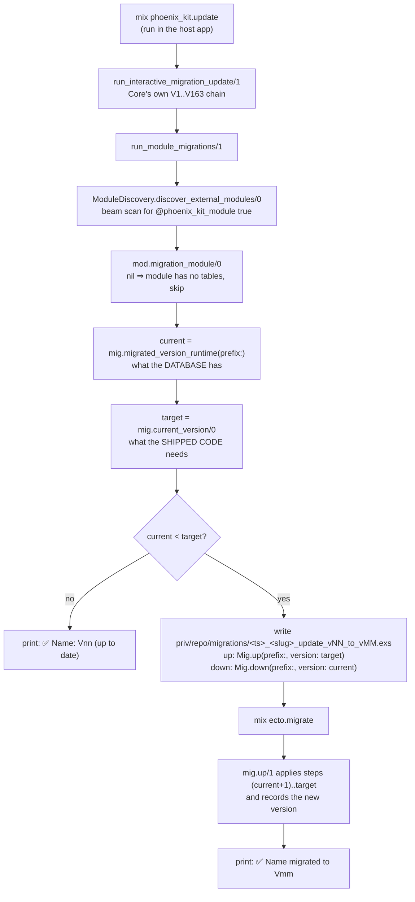

# Module-owned migrations and the version Core reports — audit of the Legal module

**Date:** 2026-08-10
**Repos:** `BeamLabEU/phoenix_kit_legal` (audited), `BeamLabEU/phoenix_kit` 1.7.227 (protocol owner), `phoenix_kit_hello_world` (rules template)
**Verified against:** live decor-shop install (core V163, legal 0.1.10), Tidewave `project_eval` + `execute_sql_query`
**Independent recheck:** GLM 5.2 as the `reviewer` persona — PASS, one correction (F2 reachability) and five additions (F4 structural, F7, F8, F9, fix-plan step 3), all folded in and re-verified against the code
**Verdict:** the version Core prints for Legal is **accidentally correct at V1 and wrong by construction at V2**. Legal's own migration has never run on any host that ran Core's chain.

---

## Summary

`mix phoenix_kit.update` reports `✅ Legal: V01 (up to date)`. That line is true only
because two unrelated things happen to agree at version 1:

1. Legal's `migrated_version_runtime/1` does not read a stored version. It checks
   whether `phoenix_kit_consent_logs` exists and returns `@current_version` if it does.
   At `@current_version 1` "the table exists" and "the schema is at V1" are the same
   statement. At `@current_version 2` they stop being the same statement, and the
   function starts reporting 2 for a database that is still at 1.
2. The table it checks for was created by **Core's V43**, not by Legal. Core's chain
   runs before module migrations in the same task, so the table always pre-exists,
   Legal is always judged up to date, and `PhoenixKit.Modules.Legal.Migrations.ConsentLogs.up/1`
   is dead code on every real install.

Nothing fails today. F1 fails silently the day Legal ships a V2; the rest are armed by
fixing F1, which makes the fix order in this report load-bearing rather than stylistic.

---

## How it is supposed to work

The protocol is four functions on a module named by the optional
`PhoenixKit.Module.migration_module/0` callback. Core never contains the module's DDL;
it only asks two questions and generates a migration in the **host** app that calls back
into the module's code.



Two properties make this work, and both are load-bearing:

**The version is stored, not inferred.** Core keeps it in a `COMMENT ON TABLE` on its
anchor table and reads it back with `pg_catalog.obj_description`. On the live host:

```sql
SELECT pg_catalog.obj_description(c.oid, 'pg_class')
FROM pg_class c JOIN pg_namespace n ON n.oid = c.relnamespace
WHERE n.nspname = 'public' AND c.relname = 'phoenix_kit';
-- → "163"
```

A stored marker distinguishes *absent* (0) from *installed at V1* from *installed at V7*.
Table existence cannot: it collapses every non-zero version into one answer. That is the
whole reason the marker exists, and `phoenix_kit_hello_world`'s template says so
explicitly (`lib/phoenix_kit_hello_world/migrations.ex:59-62`).

**Steps are addressed by version and are immutable once shipped.** `up/1` applies the
range `(stored+1)..target`; `down/1` applies `stored..(target+1)` in reverse, so
`down(version: 1)` means *roll back to V1*, not *remove everything*. Only
`down(version: 0)` drops. Editing an already-shipped `up_vN/1` forks upgraded hosts from
fresh ones, because upgraded hosts never re-run that step.

---

## What Legal actually does

`lib/phoenix_kit_legal/migrations/consent_logs.ex` implements the two functions Core
calls, so it is discovered and reported — that part is wired correctly and was confirmed
live:

```elixir
%{legal_loaded: true, migration_module: PhoenixKit.Modules.Legal.Migrations.ConsentLogs,
  legal_current_version: 1, legal_migrated_runtime: 1,
  core_current: 163, core_migrated: 163,
  discovered: [PhoenixKit.Modules.Legal, PhoenixKit.Modules.Publishing, ...]}
```

The implementation underneath diverges from the contract as follows. F3 is the one item
that is not this file's fault.

### F1 — the version is inferred from table existence (HIGH, silent at V2)

`consent_logs.ex:36-40`:

```elixir
case PhoenixKit.RepoHelper.repo().query("SELECT to_regclass($1)", [table]) do
  {:ok, %{rows: [[nil]]}} -> 0
  {:ok, %{rows: [[_oid]]}} -> @current_version   # ← "exists" ⇒ "current"
  _ -> 0
end
```

The moment `@current_version` becomes 2, every host whose table exists reports 2. Core
compares `2 < 2`, prints `✅ Legal: V02 (up to date)`, and never generates the V2
migration. The V2 delta is never applied anywhere, and the failure produces a
*success* line — no warning, no error, nothing to grep for. The report the user reads to
confirm the upgrade worked is the thing that hides it.

Note the query itself is parameterised (`$1`), so unlike Core's interpolated variant it
carries no prefix-injection concern. The defect is the inference, not the SQL.

### F2 — `down/1` ignores the requested version and always drops (HIGH, armed by fixing F1)

`consent_logs.ex:100-103`:

```elixir
def down(opts \\ []) do
  prefix_str = prefix_str(normalize_prefix(opts))
  execute("DROP TABLE IF EXISTS #{prefix_str}phoenix_kit_consent_logs CASCADE")
end
```

Core generates the rollback as `down(prefix: ..., version: current)` where `current` is
the version to **return to** (`phoenix_kit.update.ex:978-980`; the semantics are Core's
own, `postgres.ex:1477-1483`). So a host rolling V2 back to V1 executes `down(version: 1)`
— and gets `DROP TABLE ... CASCADE`: the entire GDPR/CCPA consent audit trail, destroyed
by a rollback whose stated target was "keep V1". The `:version` key is accepted by
`normalize_prefix/1`'s signature and then discarded.

**This is not reachable today, and the reason matters.** While F1 stands, no host with an
existing table is ever given a V2 migration at all — `migrated_version_runtime/1` reports
the target, so nothing is generated. The only hosts that get a generated migration are
those without the table (`current = 0`), whose rollback is `down(version: 0)`, and there
an unconditional `DROP` happens to be exactly what the protocol asks for. So F2 is a trap
laid for whoever fixes F1: the moment the version marker starts telling the truth, real
`down(version: N > 0)` calls begin, and this function answers all of them with `DROP`.
Fix F1 and F2 in the same change, never F1 alone.

### F3 — Core also ships this table's DDL, and wins the race (HIGH, architectural)

`deps/phoenix_kit/lib/phoenix_kit/migrations/postgres/v43.ex:47` creates
`phoenix_kit_consent_logs`, six indexes, three table/column comments and six
`phoenix_kit_settings` seeds for the `legal` module. `phoenix_kit.update.ex:653-657` runs
the Core chain first and module migrations second.

The live database proves which definition won:

| Evidence | Value on the live host | Legal's DDL would give |
|---|---|---|
| Indexes | `phoenix_kit_consent_logs_{inserted_at,session_id,session_type,type,user_uuid}_idx` | `idx_consent_logs_{user_uuid,session_id,consent_type,inserted_at}` |
| Column order | `session_id, consent_type, …, uuid, user_uuid` (V43 order, `uuid`/`user_uuid` appended by V44/V74) | `uuid, user_uuid, session_id, …` |
| Table comment | `User consent tracking for GDPR/CCPA compliance cookie banners` (V43) | nothing — Legal writes no comment |

Not one of Legal's index names exists. Legal's `up/1` has never executed here. The module
declares ownership of a table it does not, in practice, create.

### F4 — the two definitions disagree (MEDIUM)

Because both DDLs exist, the schema a host ends up with depends on its history:

| Column | Core V43 | Legal `up/1` |
|---|---|---|
| `session_id` | `varchar(64)` | `varchar(255)` |
| `consent_type` | `varchar(30)` | `varchar(50)` |
| `consent_version` | `varchar(20)` | `varchar(50)` |
| `metadata` | nullable, default `'{}'` | `NOT NULL DEFAULT '{}'` |
| primary key | implicit `id bigserial` (`v43.ex:47` omits `primary_key: false`) | `uuid UUID PRIMARY KEY` |
| user column | `user_id bigint` | `user_uuid UUID` |

The last two rows are the deeper divergence: the two files disagree about the table's
identity, not just its column widths. On the live host Core's own later steps (V44 adds
`uuid`, V74 replaces `user_id` with `user_uuid`) converged its shape onto uuid identity,
so `PhoenixKit.Modules.Legal.ConsentLog`'s fields do match what is there — the schema is
not broken. The width divergence surfaces elsewhere: `consent_log.ex:119-120` validates
only `:consent_type` (required + inclusion) and has no `validate_length/3`, so a
`session_id` longer than 64 characters is rejected by the database on a Core-created table
and accepted on a Legal-created one. Same code, two behaviours, decided by install history.

### F5 — the comment slot is already occupied, which blocks the obvious fix (MEDIUM)

The canonical marker is a `COMMENT ON TABLE`, and on this table V43 already put a
*human description* there. The template's reader does:

```elixir
{:ok, %{rows: [[version]]}} when is_binary(version) -> String.to_integer(version)
_ -> 1
```

`String.to_integer("User consent tracking for …")` raises. In
`migrated_version_runtime/1` the `rescue _ -> 0` swallows it and reports **0 — not
installed**, so Core would generate a fresh V1 migration on a populated database. In a
migration-context `migrated_version/1` (no rescue) it raises mid-migration. So Legal
cannot adopt the template verbatim: its reader must treat a non-numeric comment as
"legacy Core-created table, V1", never as 0 and never as a crash.

### F6 — `up/1` has no version steps (LOW today, blocker for V2)

`up/1` ignores `opts[:version]` and always emits the full V1 DDL. Harmless while there is
one version — every statement is `IF NOT EXISTS` — but there is no `up_vN/1` dispatch to
extend, so V2 cannot be expressed without restructuring the module first.

### F7 — `uuid_generate_v7()` is called bare and never ensured (MEDIUM, prefix installs)

`consent_logs.ex:57` writes `DEFAULT uuid_generate_v7()`. Core never calls it unqualified:
`Helpers.uuid_v7_call/1` returns `"#{schema(prefix)}.uuid_generate_v7()"`
(`helpers.ex:92`), because on a named-schema install the function is created inside that
schema and a bare call depends on the connecting role's `search_path`. Legal also never
calls `Helpers.ensure_uuid_v7_function/1`, so it assumes Core's chain already created the
function — the exact assumption the template tells modules not to make
(`hello_world/migrations.ex:114-116`). Dead code today via F3, and a failure the first time
`up/1` actually runs against `--prefix`.

### F8 — a blanket `rescue` reports database failures as "not installed" (MEDIUM)

`consent_logs.ex:41-43` wraps the whole function in `rescue _ -> 0`. Any failure —
connection refused, revoked privileges, a parse error like F5 — becomes `0`, and `0` means
"module not installed" to Core, which then generates a fresh V1 migration against a
populated database. Core deliberately does not swallow this class of error in its own
reader (`postgres.ex:1542-1543`). A reader that cannot determine the version should not be
able to claim the version is zero.

### F9 — no migration-context `migrated_version/1` (LOW)

The contract has two readers: `migrated_version/1` for migration context (through
`Ecto.Migration.repo/0`) and `migrated_version_runtime/1` for Mix-task context. Legal ships
only the second. Harmless while `up/1` does not branch on version, and a gap the moment it
does.

---

## What the fix looks like

Ordered, because F5 gates the rest:

1. **Tolerant version reader.** Store the marker in the table comment like Core, but read
   it as: numeric comment → that integer; non-numeric or absent comment on an existing
   table → `1` (a V43-created table is a V1 table); table absent → `0`. Never raise, never
   report 0 for an existing table, and drop the blanket `rescue` (F8) so a database that
   cannot answer is not misread as a database with nothing in it.
2. **Version-stepped `up/1`, target-honouring `down/1`** — in the same change as step 1,
   never after it (F2). `apply_step(:up, N, prefix)` / `apply_step(:down, N, prefix)`
   dispatch, `change/3` recording the new version after each range, `down` dropping the
   table only when the target is 0, and `Helpers.uuid_v7_call/1` +
   `ensure_uuid_v7_function/1` replacing the bare function call (F7).
3. **Converge the two schemas in a V2 step.** V2 becomes the reconciliation: widen the V43
   column sizes, settle `metadata` nullability, and write `COMMENT ON TABLE … IS '2'`.
   Two things to get right. Indexes must be *reconciled, not added* — the live host already
   carries Core's six `phoenix_kit_consent_logs_*_idx`, so creating Legal's four
   `idx_consent_logs_*` alongside them leaves the table with two overlapping index sets to
   maintain; pick one naming scheme and drop the other. And writing the version marker
   overwrites V43's human description of the table — an acceptable trade for a working
   version marker, but the description should move to a column comment rather than just be
   lost. The step must reach the same end state from either starting shape, because both
   exist in the wild.
4. **Leave Core's V43 alone.** A shipped chain is replayable history — deleting V43 breaks
   every fresh install replaying V1..V163. The realistic split is: V43 stays as the
   historical origin, and from V2 onward Legal's own migration is the sole authority for
   this table. That boundary is worth stating in Core's V43 moduledoc so the next person
   does not add a V164 that touches consent logs.

Step 3 needs a decision on the authoritative column sizes, and steps 1–2 are a
restructure of a file that currently runs on no host — so the change is safe to make but
not mechanical.

---

## Resolution

All three steps landed the same day. The decisions taken, and two things the audit above
did not know:

**Column widths and index names.** Widths take the wider of the two (255/50/50) — widening
a varchar is catalogue-only in Postgres and rejecting a long `session_id` at the database
layer is worse than storing it. Index *names* take Core's, because those are the ones every
existing host already carries; this module's four have never existed anywhere, so adopting
Core's means V2 creates nothing on a Core-created table and only drops the never-deployed
names where they somehow exist.

**V1's DDL was corrected, not frozen.** That contradicts the immutability rule, and it is
sound only because of F3: Core's chain reaches V43 long before any core release this module
supports, so `up_v1/1` was unreachable on every host. Recorded in the moduledoc and
AGENTS.md as an exception that does not extend to `up_v2/1`.

### Two findings that only appeared during implementation

**`ensure_uuid_v7_function/1` does not install extensions.** F7 said to schema-qualify the
`uuid_generate_v7()` call and ensure the function. Doing exactly that still produced a
table that failed on first insert: the function is built on pgcrypto's `gen_random_bytes`,
and ensuring the function does not ensure pgcrypto. On every real host Core's chain has
already installed it, which is why neither the audit nor the independent review saw this —
it only surfaces on a database that has not run Core's chain, i.e. exactly the standalone
case the module claims to support. `Helpers.ensure_extension!("pgcrypto")` now runs first.

**`CREATE INDEX IF NOT EXISTS` matches on name, not definition.** The reconciliation
originally specified `(inserted_at DESC)` for an index whose Core-created counterpart is
`btree (inserted_at)`. Because the name matches, Postgres skips creation on every upgraded
host and applies the `DESC` version only to fresh installs — reintroducing the two-shapes
divergence that the step exists to remove, in the step that removes it. Matching Core's
definitions exactly is therefore part of the contract, not a detail. A plain btree serves
`ORDER BY inserted_at DESC` by scanning backwards, so nothing was lost by conforming.

### Verification

The ExUnit suite runs without a repo, so it pins the protocol shape and the
prefix-raises behaviour only (4 tests, 42 total). The DDL is covered by
`test/scripts/verify_consent_logs_migration.exs` against a real Postgres — 35 assertions,
all passing:

| Case | Asserted |
|---|---|
| Fresh install 0→2 | table, marker `"2"`, canonical indexes, `metadata NOT NULL` |
| `up(version: 2)` twice | idempotent |
| **Rollback 2→1** | **table and row survive**, marker `"1"`, `metadata` nullable again |
| Rollback 1→0 | table dropped |
| Legacy V43 shape, prose comment | reads as V1; V2 widens 64→255, 30→50, 20→50, backfills NULL `metadata`, drops the legacy index |
| Named-schema install | works, `uuid_generate_v7()` resolves inside the prefix |
| Invalid prefix | raises `ArgumentError` |
| **Both paths converge** | column types, widths, defaults **and index definitions** identical between a converged-legacy schema and a fresh one |

The last row is the one that earned its keep: it is what caught the `DESC` mistake, and it
was confirmed non-vacuous by reintroducing that mistake and watching it fail.

---

## Rules for module-owned migrations

`phoenix_kit_hello_world`'s `lib/phoenix_kit_hello_world/migrations.ex` is the canonical
template and already encodes most of this — including, verbatim, the reason F1 is a bug.
What this audit adds to it:

- **Never infer the version from table existence.** Existence answers "is it 0?" and
  nothing else.
- **A table's comment is the version slot.** Human documentation goes on columns, or the
  version marker has nowhere to live. Legacy tables may already have prose there; the
  reader must survive it.
- **A reader that cannot determine the version must not answer 0.** Zero means "not
  installed" and triggers a fresh install against live data. Let unexpected failures raise.
- **`down(version: N)` returns to N.** Unconditional `DROP TABLE` is only correct for
  `version: 0`. And ship the honest reader and the honest `down` together — a truthful
  version marker is what starts routing real rollback targets into `down/1`.
- **One DDL per table, in the module.** If Core's chain also creates it, the module's
  migration is dead code and the two definitions drift. Check before assuming ownership.
- **Assume nothing about Core's chain having run.** Schema-qualify `uuid_generate_v7()` via
  `Helpers.uuid_v7_call/1` and call `ensure_uuid_v7_function/1` first; pass `prefix:` to
  every table/index/alter and keep index names bare on `CREATE`.
- **Ship both readers.** `migrated_version/1` for migration context,
  `migrated_version_runtime/1` for Mix-task context.
- **Reconcile, don't accumulate.** When a table already exists in the wild with someone
  else's index names or column widths, a converging step replaces them; adding a parallel
  set leaves every host maintaining both.
- **Verify on a real host, not by reading code.** The three queries that settle it: the
  table's `obj_description` (is the marker numeric?), `pg_indexes` (whose index names?),
  and `information_schema.columns` order (whose `CREATE TABLE`?).
